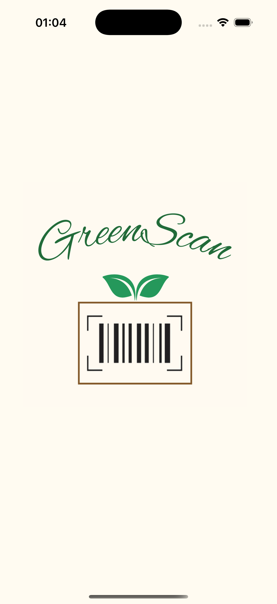
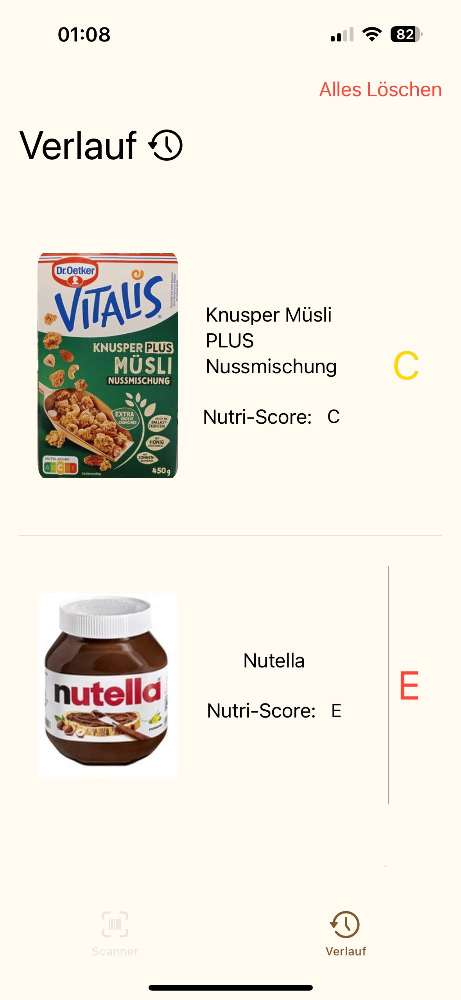
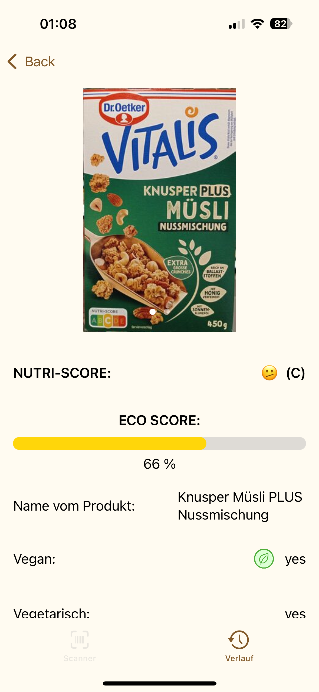
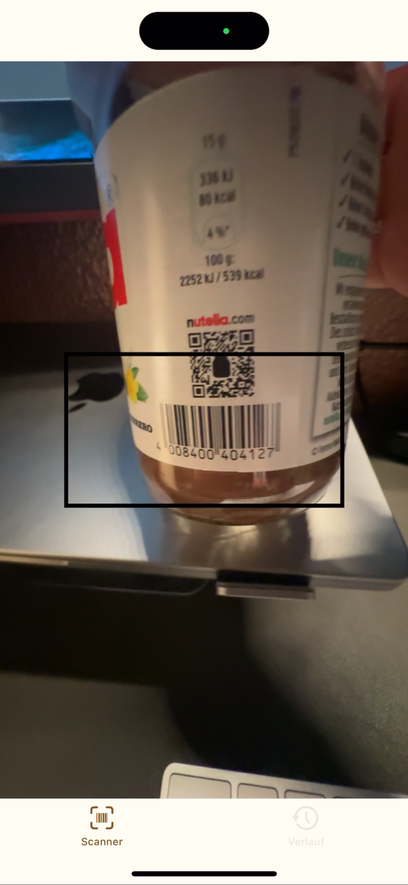

# GreenScan – Deine App für nachhaltige Lebensmittelwahl

**Scanne. Erfahre. Entscheide nachhaltig.**

GreenScan ist eine innovative Scanner-App, mit der du den Eco-Score von Lebensmitteln schnell und einfach erfassen kannst. Scanne den Barcode eines Produkts, um sofort Informationen über seine Umweltfreundlichkeit zu erhalten. So kannst du bewusste Kaufentscheidungen treffen und einen positiven Beitrag zur Nachhaltigkeit leisten.

  <!-- -->
     
 

## Features
<!-- Hier kommen alle Features rein, welche deine App bietet. -->

- [x] Barcode-Scanner für Lebensmittelprodukte
- [x] Anzeige des Eco-Scores für eine umweltfreundliche Wahl
- [x] Detaillierte Produktinformationen & Nachhaltigkeitsbewertung
- [x] Verlauf deiner gescannten Produkte

## Technischer Aufbau

Das Projekt verwendet Swift und basiert auf der MVVM-Architektur (Model-View-ViewModel).

• <b>Models:</b> 
Enthält die Datenstrukturen für Produkte und verarbeitet Daten aus der Open Food Facts API sowie SwiftData.

• <b>Views:</b> 
Alle SwiftUI-Views, die die Benutzeroberfläche der App darstellen.
Sie beziehen ihre Daten direkt aus den ViewModels.

• <b>ViewModels:</b> 
Verarbeitet Daten aus dem Model und bereitet sie für die Views auf.
Enthält die Geschäftslogik und steuert die Kommunikation zwischen View und Model.

• <b>Repositories:</b> 
Abstraktionsschicht für den Datenzugriff. Koordiniert die Kommunikation zwischen Open Food Facts API und SwiftData, um eine zuverlässige Datenquelle bereitzustellen.

• <b>Client:</b> 
Beinhaltet die API-Schnittstellen und Netzwerkanfragen zur Open Food Facts API sowie die Konfiguration für SwiftData.
 

GreenScan nutzt SwiftData für die lokale Speicherung von Produktinformationen.

Vorteile von Swift Data?
  
• <b>Offline-First:</b> 
Daten werden lokal gespeichert und stehen jederzeit zur Verfügung.

• <b>Einfache Integration:</b> 
SwiftData ist direkt in SwiftUI integriert und benötigt keine externe Konfiguration.

• Effiziente Speicherung:
Durch die enge Anbindung an Swift ist die Datenverwaltung optimiert und performant.

Gespeicherte Daten

<b>Produktinformation:</b> 
•Caching von abgerufenen Produktdetails (z. B. Nährwerte, Zutaten).

GreenScan nutzt die [Open Food Facts API](https://world.openfoodfacts.org/) als Hauptquelle für Produktinformationen.
Da es sich um eine offene Datenbank handelt, stehen aktuelle und umfassende Informationen zu Millionen von Lebensmitteln weltweit zur Verfügung.

Verwendete API-Endpunkte:
<b>Verwendete Endpunkte der Open Food Facts API:</b> 

•GET /product/{barcode} – Ruft Informationen zu einem Produkt anhand des Barcodes ab

Die API-Daten werden in der App verarbeitet, im Repository abgefragt und im ViewModel aufbereitet, bevor sie in der UI dargestellt werden.
Um eine schnelle und stabile Benutzererfahrung zu gewährleisten, werden relevante Produktinformationen mit SwiftData lokal gespeichert.
	

## Ausblick

- [ ] Erweiterung der Nachhaltigkeitsbewertung
	•	Anzeige weiterer Umweltkennzeichnungen wie CO₂-Fußabdruck, Fairtrade-Siegel oder Bio-Zertifizierungen
	•	Erweiterung um soziale & ethische Bewertungen von Produkten

- [ ] Produktbewertungen & Community-Interaktion
	•	Nutzer können nachhaltige Alternativen vorschlagen
	•	Möglichkeit, eigene Erfahrungen mit Produkten zu teilen

- [ ] Ernährungsprofile & persönliche Empfehlungen
	•	Individuelle Ernährungseinstellungen (z. B. vegan, glutenfrei)
	•	Intelligente Produktempfehlungen basierend auf persönlichen Vorlieben

- [ ] Offline-Modus für Scans ohne Internet
	•	Gespeicherte Produkte auch ohne Verbindung abrufbar
	•	Späteres Synchronisieren mit der Open Food Facts API

- [ ] Integration von Einkaufslisten & Preisvergleiche
	•	Nutzer können gescannte Produkte auf eine Einkaufsliste setzen
	•	Verknüpfung mit Supermarkt-Preisen für einen direkten Preisvergleich
- [ ] ...
